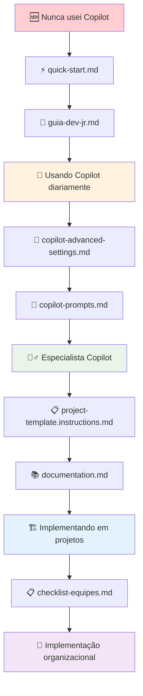

# 🎯 ÍNDIC### 🔧 **Configurações e Setup**

- **[📁 Estrutura de Pastas](estrutura-pastas.md)** - 🎯 **NOVO!** Por que comandos ficam "foscos" e como corrigir
- **[🎯 Comandos de Execução](comandos-execucao.md)** - 🎯 **NOVO!** Como forçar o Copilot a executar ao invés de explicar
- **[🧠 Análise de Comandos](analise-comandos.md)** - 🎯 **NOVO!** Por que comandos não funcionam e como corrigir
- **[⚙️ Configurações VS Code](vscode-config.md)** - Settings completas para GitHub Copilot 2025
- **[🚀 Quick Start](quick-start.md)** - Setup rápido em 5 minutos
- **[🔄 Migração 2025](MIGRAÇÃO-2025.md)** - 🎯 **NOVO!** Configurações deprecated e como migrarPERFIL DE USUÁRIO

## 👤 **ESCOLHA SEU PERFIL E SIGA O CAMINHO IDEAL**

---

## 🆕 **DEV JR - PRIMEIRO CONTATO COM COPILOT**

### 📋 **DOCUMENTAÇÃO PRINCIPAL**

### 🔧 **Configurações e Setup**

- **[📁 Estrutura de Pastas](estrutura-pastas.md)** - 🎯 **NOVO!** Por que comandos ficam "foscos" e como corrigir
- **[⚙️ Configurações VS Code](vscode-config.md)** - Settings completas para GitHub Copilot 2025
- **[� Quick Start](quick-start.md)** - Setup rápido em 5 minutos
- **[🔄 Migração 2025](MIGRAÇÃO-2025.md)** - 🎯 **NOVO!** Configurações deprecated e como migrar

### 🎯 **Objetivo:**

Sair do zero para produtivo em **1 dia**, sem errar nenhum passo da configuração.

### ✅ **Sucesso = Conseguir:**

- Aceitar sugestões com Tab
- Usar @workspace no chat
- Seguir padrões do projeto
- Criar testes com Copilot

---

## 👨‍💻 **DEV EXPERIENTE - JÁ USA COPILOT MAS QUER MELHORAR**

### 📋 **Seu Roteiro:**

1. **🤖 `copilot-advanced-settings.md`** - Configurações avançadas
2. **🎯 `copilot-prompts.md`** - Prompts profissionais
3. **🎛️ `chat-modes.md`** - Modos de chat customizados
4. **📚 `documentation.md`** - Workflows avançados

### 🎯 **Objetivo:**

Evoluir de uso básico para **especialista em automação** com Copilot.

### ✅ **Sucesso = Conseguir:**

- Configurar allowList/denyList
- Criar modos de chat customizados
- Automatizar workflows de desenvolvimento
- Ensinar outros desenvolvedores

---

## 🏗️ **ARQUITETO/TECH LEAD - IMPLEMENTANDO EM PROJETOS**

### 📋 **Seu Roteiro:**

1. **📋 `project-template.instructions.md`** - Template para projetos
2. **⚙️ `vscode-config.md`** - Configuração completa de workspace
3. **📚 `documentation.md`** - Estratégias de implementação
4. **🎛️ `copilot-chat-modes.json`** - Configuração padrão da equipe

### 🎯 **Objetivo:**

Padronizar uso do Copilot em **toda a arquitetura** do projeto.

### ✅ **Sucesso = Conseguir:**

- Criar arquivo .instructions.md do projeto
- Configurar padrões arquiteturais
- Automatizar validações
- Garantir consistência da equipe

---

## 👔 **GESTOR/CTO - IMPLEMENTANDO NA ORGANIZAÇÃO**

### 📋 **Seu Roteiro:**

1. **📋 `checklist-equipes.md`** - Implementação corporativa (PRIMEIRO)
2. **🚀 `guia-dev-jr.md`** - Para entender o que sua equipe precisa
3. **🤖 `copilot-advanced-settings.md`** - Políticas de segurança
4. **📚 `documentation.md`** - ROI e métricas de sucesso

### 🎯 **Objetivo:**

Implementar Copilot em **escala organizacional** com ROI mensurável.

### ✅ **Sucesso = Conseguir:**

- 90%+ adoção da equipe
- Redução 40%+ no onboarding
- Melhoria mensurável na qualidade
- Políticas de segurança aplicadas

---

## 🎓 **PROFESSOR/MENTOR - ENSINANDO COPILOT**

### 📋 **Seu Roteiro:**

1. **🚀 `guia-dev-jr.md`** - Base pedagógica
2. **📸 `guia-visual.md`** - Material de apoio visual
3. **⚡ `quick-start.md`** - Exercício prático de aula
4. **📋 `checklist-equipes.md`** - Para turmas/equipes

### 🎯 **Objetivo:**

Ensinar uso **correto e seguro** do Copilot para novos desenvolvedores.

### ✅ **Sucesso = Conseguir:**

- Alunos configurando sem erros
- Entendimento sobre segurança
- Uso seguindo boas práticas
- Autonomia para evoluir

---

## 🔧 **DevOps/SRE - CONFIGURAÇÕES E AUTOMAÇÃO**

### 📋 **Seu Roteiro:**

1. **🤖 `copilot-advanced-settings.md`** - Segurança e allowLists
2. **⚙️ `vscode-config.md`** - Automação de configuração
3. **📋 `checklist-equipes.md`** - Implementação em CI/CD
4. **🎛️ `copilot-chat-modes.json`** - Configuração via settings

### 🎯 **Objetivo:**

Configurar Copilot de forma **segura e automatizada** em toda infraestrutura.

### ✅ **Sucesso = Conseguir:**

- AllowList/DenyList corporativos
- Settings distribuídos automaticamente
- Auditoria de comandos
- Políticas de segurança aplicadas

---

## 📊 **RESUMO RÁPIDO POR URGÊNCIA**

### 🚨 **PRECISO USAR HOJE** (5 min)

```bash
quick-start.md → Configure e comece a usar
```

### ⏰ **TENHO 1 HORA** (Completo)

```bash
quick-start.md → guia-dev-jr.md → Pronto para produção
```

### 📅 **TENHO 1 DIA** (Especialista)

```bash
Todos os arquivos do seu perfil → Configuração completa
```

### 🏢 **IMPLEMENTAÇÃO EMPRESARIAL** (1 semana)

```bash
checklist-equipes.md → Seguir cronograma → ROI mensurado
```

---

## 🔄 **FLUXO RECOMENDADO POR MATURIDADE**



---

## 🎯 **QUAL ARQUIVO LER PRIMEIRO?**

### ❓ **Se você é...**

| Perfil                       | Primeiro Arquivo                   | Por quê?                              |
| ---------------------------- | ---------------------------------- | ------------------------------------- |
| 👶 **Nunca usei Copilot**    | `quick-start.md`                   | Setup básico funcionando em 5 min     |
| 💻 **Uso básico**            | `copilot-advanced-settings.md`     | Desbloquear funcionalidades avançadas |
| 🏗️ **Implementando projeto** | `project-template.instructions.md` | Padronizar uso na equipe              |
| 👔 **Implementando empresa** | `checklist-equipes.md`             | Roadmap completo organizacional       |
| 🎓 **Ensinando outros**      | `guia-dev-jr.md`                   | Base pedagógica sólida                |

---

## 💡 **DICAS FINAIS**

1. **📚 SEMPRE comece pelo seu perfil** - não pule etapas
2. **🔄 Use consistentemente** por 1-2 semanas antes de avançar
3. **📊 Meça os resultados** - tempo, qualidade, satisfação
4. **🤝 Compartilhe aprendizados** com a equipe
5. **🚀 Evolua incrementalmente** - perfeição vem com uso

---

**🎯 ESCOLHA SEU CAMINHO E ARREBENTE! 🚀**
