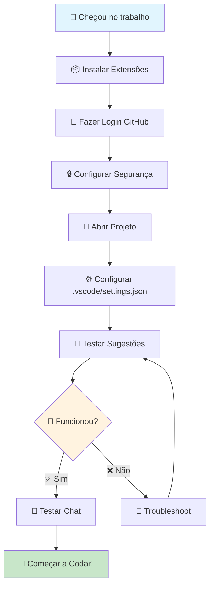

# 📸 Guia Visual - Screenshots e Fluxogramas

## 🎯 **FLUXOGRAMA: PRIMEIRO DIA COM COPILOT**



---

## 📸 **SCREENSHOTS ESSENCIAIS**

### 🔍 **1. Como Encontrar as Extensões**

**Localização no VS Code:**

```
┌─────────────────────────────────────┐
│ File  Edit  View  Go  Run  Terminal │ ← Menu Superior
├─────────────────────────────────────┤
│ 📁 Explorer                         │
│ 🔍 Search                          │
│ 🔧 Source Control                  │
│ 🐛 Run and Debug                   │
│ 📦 Extensions  ← CLIQUE AQUI       │ ← Barra Lateral
│ 🧪 Testing                         │
│ 📊 GitLens                         │
└─────────────────────────────────────┘
```

**O que procurar:**

```
🔍 Search Extensions in Marketplace

GitHub Copilot                    ⭐ 4.5 | 2.3M downloads
🏢 GitHub                         [Install]

GitHub Copilot Chat              ⭐ 4.3 | 1.8M downloads
🏢 GitHub                         [Install]
```

### 🔐 **2. Processo de Login**

**Passos Visuais:**

```
1. Canto Inferior Esquerdo:
   👤 [Accounts] ← Clique aqui

2. Menu que aparece:
   ┌─────────────────────┐
   │ Turn on Cloud Sync  │
   │ Sign in to sync...  │ ← Clique aqui
   └─────────────────────┘

3. Opções que aparecem:
   ┌─────────────────────┐
   │ 🐱 GitHub           │ ← Clique aqui
   │ 🔵 Microsoft        │
   └─────────────────────┘

4. Navegador vai abrir:
   [Authorize VS Code] ← Clique aqui
```

### ⚙️ **3. Onde Configurar Segurança**

**Caminho das Configurações:**

```
Ctrl+, (vírgula)
│
├─── 🔍 Search settings
│    └─── Digite: "copilot telemetry"
│         └─── ☑️ Desmarque a opção
│
├─── 🔍 Search settings
│    └─── Digite: "telemetry level"
│         └─── 🔽 Mude para "error"
│
└─── 🔍 Search settings
     └─── Digite: "github copilot chat"
          └─── Configure allowList/denyList
```

---

## 🎮 **ATALHOS VISUAIS - COLE NA SUA MESA!**

```
╔══════════════════════════════════════╗
║           🎯 COPILOT CHEAT SHEET      ║
╠══════════════════════════════════════╣
║                                      ║
║  💬 CHAT COMMANDS:                   ║
║  Ctrl+Alt+I  → Open Chat             ║
║  Ctrl+I      → Inline Chat           ║
║                                      ║
║  🎯 CODE SUGGESTIONS:                ║
║  Tab         → Accept                ║
║  Esc         → Reject                ║
║  Ctrl+→      → Accept word           ║
║                                      ║
║  🔍 CONTEXT HELPERS:                 ║
║  @workspace  → Full project          ║
║  #file:name  → Specific file         ║
║  #selection  → Selected code         ║
║                                      ║
║  ⚡ QUICK PROMPTS:                   ║
║  "Explique este código"              ║
║  "Crie testes para isso"             ║
║  "Como melhorar este código?"        ║
║  "Qual o problema aqui?"             ║
║                                      ║
╚══════════════════════════════════════╝
```

---

## 📋 **CHECKLIST VISUAL - IMPRIMA E USE!**

```
┌─────────────────────────────────────────┐
│  🚀 CHECKLIST SETUP COPILOT - DEV JR    │
├─────────────────────────────────────────┤
│                                         │
│  📦 INSTALAÇÃO:                         │
│  □ GitHub Copilot instalado             │
│  □ GitHub Copilot Chat instalado        │
│  □ Login feito no GitHub                │
│  □ Ícone do Copilot aparece na barra    │
│                                         │
│  🔒 SEGURANÇA:                          │
│  □ Telemetry desabilitado              │
│  □ Terminal allowList configurado      │
│  □ Auto-approve desabilitado           │
│                                         │
│  ⚙️ CONFIGURAÇÃO:                       │
│  □ Pasta .vscode criada                 │
│  □ settings.json configurado            │
│  □ Comandos seguros definidos          │
│                                         │
│  🧪 TESTES:                             │
│  □ Sugestão de código funciona (Tab)    │
│  □ Chat funciona (Ctrl+Alt+I)          │
│  □ @workspace responde                  │
│  □ Consegue explicar arquivo            │
│                                         │
│  ✅ PRONTO PARA USAR!                   │
└─────────────────────────────────────────┘
```

---

## 🚨 **TROUBLESHOOTING VISUAL**

### ❌ **PROBLEMA**: "Não está aparecendo sugestões"

**DIAGNÓSTICO VISUAL:**

```
🔍 Verifique a Barra de Status (inferior):

✅ CORRETO:
[👤 seu-nome] [🤖 Copilot: ✓] [🔄 Sync] [main] [Python]
                   ↑
              Deve estar assim

❌ PROBLEMA:
[👤 seu-nome] [🤖 Copilot: ✗] [🔄 Sync] [main] [Python]
                   ↑
              Ou sem ícone
```

**SOLUÇÃO:**

```
1. Ctrl+Shift+P
2. Digite: "GitHub Copilot: Sign In"
3. Siga processo de autorização
4. Reinicie VS Code se necessário
```

### ❌ **PROBLEMA**: "Chat não abre"

**DIAGNÓSTICO:**

```
Ctrl+Alt+I não funciona?

🔍 Verificar:
1. Extensions → GitHub Copilot Chat → ✅ Enabled
2. View → Command Palette → "GitHub Copilot: Open Chat"
3. Reiniciar VS Code
```

### ❌ **PROBLEMA**: "Comandos sendo negados"

**ISSO É NORMAL! É A SEGURANÇA:**

```
┌──────────────────────────────────────┐
│ ⚠️  Terminal Access Required          │
├──────────────────────────────────────┤
│                                      │
│ Copilot wants to run:                │
│ $ rm -rf node_modules                │
│                                      │
│ This command is not in allowList     │
│                                      │
│ [❌ Cancel] [⚠️ Continue] [📝 Always] │
└──────────────────────────────────────┘

✅ LEIA o comando antes de clicar!
❌ NUNCA clique "Always" em comandos perigosos
```

---

## 📊 **DASHBOARD DE PROGRESSO SEMANAL**

```
SEMANA 1: 🥾 PRIMEIROS PASSOS
┌─────────────────────────┐
│ 📦 Setup Básico    [██] │ 100%
│ 🔒 Segurança       [██] │ 100%
│ 💬 Primeiro Chat   [█░] │  50%
│ 🧪 Testes Simples  [░░] │   0%
└─────────────────────────┘

SEMANA 2: 🚀 DESENVOLVIMENTO
┌─────────────────────────┐
│ 🎯 Usar @workspace [░░] │   0%
│ 🧪 Criar Testes    [░░] │   0%
│ 🐛 Debug Código    [░░] │   0%
│ 📚 Documentação    [░░] │   0%
└─────────────────────────┘

SEMANA 3: 💪 NINJA LEVEL
┌─────────────────────────┐
│ ⚡ Modos Custom    [░░] │   0%
│ 🔧 Refatoração    [░░] │   0%
│ 🎨 Padrões Proj   [░░] │   0%
│ 🏆 Autonomia      [░░] │   0%
└─────────────────────────┘
```

---

## 🎯 **MÉTRICAS DE SUCESSO**

**Como saber que você está evoluindo:**

### 🥉 **NÍVEL BRONZE** (Semana 1)

```
✅ Consegue aceitar sugestões com Tab
✅ Abre o chat e faz perguntas básicas
✅ Entende quando um comando é perigoso
✅ Não quebra o código dos colegas
```

### 🥈 **NÍVEL PRATA** (Semana 2)

```
✅ Usa @workspace para contexto
✅ Pede para criar testes automaticamente
✅ Consegue debuggar com ajuda do Copilot
✅ Segue padrões do projeto
```

### 🥇 **NÍVEL OURO** (Semana 3+)

```
✅ Configura modos personalizados
✅ Refatora código seguindo boas práticas
✅ Ensina outros devs a usar Copilot
✅ Desenvolve 3x mais rápido que antes
```

---

## 🎁 **BONUS: TEMPLATES PRONTOS PARA USAR**

### 📄 **Template de Pergunta Perfeita**

```
@workspace

Contexto: [Explique o que você está fazendo]

Objetivo: [O que você quer alcançar]

Restrições: [Tecnologias, padrões, limitações]

Exemplo: [Se tiver um exemplo similar no projeto]

Pergunta: [Sua pergunta específica]
```

### 🧪 **Template para Pedir Testes**

```
#selection

Seguindo os padrões de teste deste projeto:

1. Crie testes unitários para esta função
2. Inclua casos de sucesso e falha
3. Use as mesmas bibliotecas de teste do projeto
4. Mantenha a mesma estrutura de pastas

Gere os testes e me explique o que cada um valida.
```

### 🐛 **Template para Debug**

```
@workspace #file:arquivo-com-problema.py

Estou tendo este erro: [cole o erro aqui]

Contexto do que estava fazendo: [explique]

Este arquivo está relacionado com: [outros arquivos/funcionalidades]

Pode me ajudar a:
1. Entender a causa do erro
2. Propor uma solução seguindo padrões do projeto
3. Prevenir problemas similares no futuro
```

---

**🎯 COM ESTE GUIA VISUAL, IMPOSSÍVEL ERRAR!**

Agora você tem:

- ✅ Passo a passo visual
- ✅ Checklists para imprimir
- ✅ Troubleshooting com imagens
- ✅ Templates prontos para usar
- ✅ Métricas para acompanhar evolução

**🚀 Vai lá e arrebenta! O Copilot está esperando você! 🤖✨**
